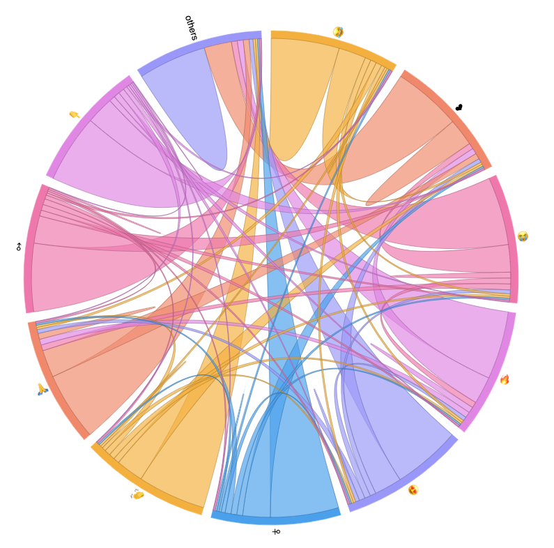
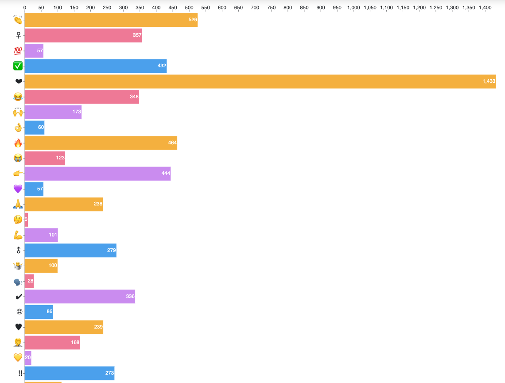

# Tmoji

Tmoji: An automatic tweet's emoji analysis platform

## Installnation

Before you use the system, you need to install some requirments 

- MongoDB v4.2.6
- python packages in `requirments.txt`

## Usage

1. Run scripts in `Acquisition/` folder to preprocess the raw data and store them into database.
2. Run all jupter notebooks in `Analysis/` folder to get 11 task results and store them into database.
3. run the follow command, and check website at `localhost:8000`.

```bash
cd backend
python manage.py runserver 8000
```

## Dataset

EmojifyData-EN dataset can be download [here](https://www.kaggle.com/rexhaif/emojifydata-en).

## Charts

Some analyze charts of Tmoji:






More can be found at `screenchot/` folder.


## Developers

[Qi Yin🤓](https://github.com/yq605879396), [Victoria Yen🥳](https://github.com/vy538), [Yuan Li🤯](https://github.com/FoxerLee), [Mengxi Wu🧐](https://github.com/WMX567)
